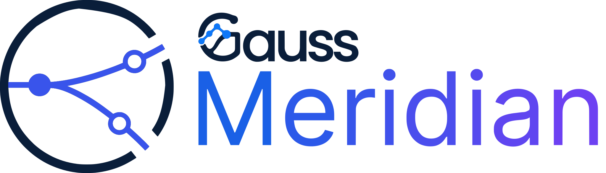
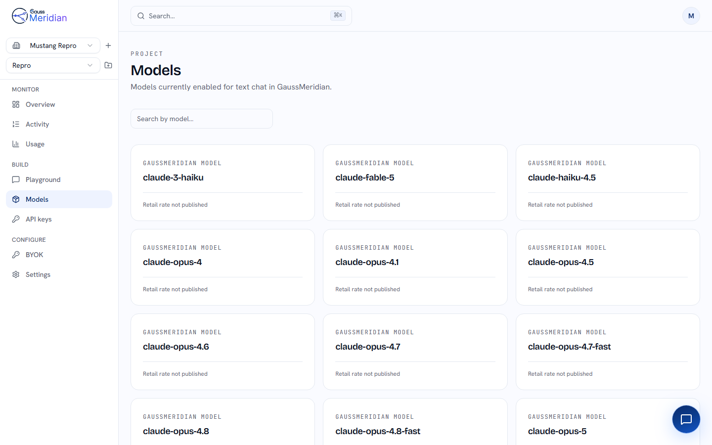
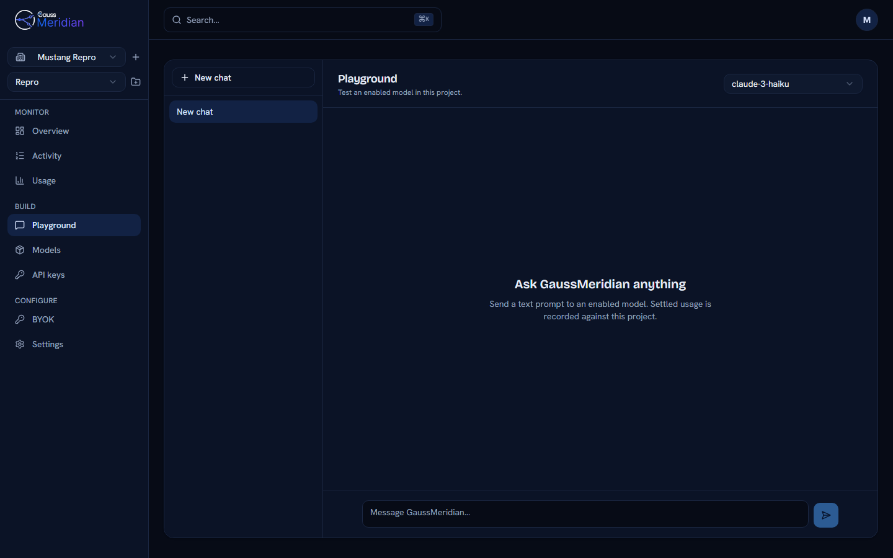
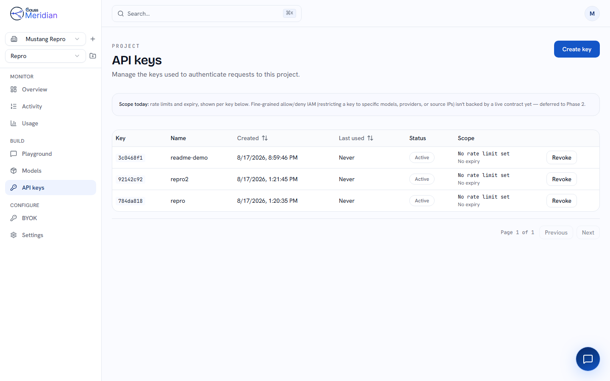
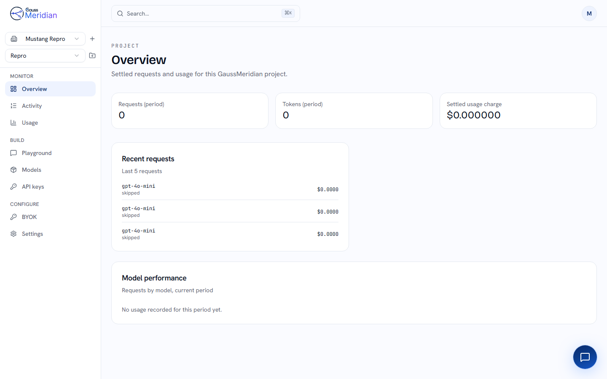
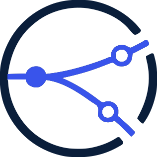

<div align="center">

<picture>
  <source media="(prefers-color-scheme: dark)" srcset="webui/public/logo/meridian-lockup-light.svg">
  
</picture>

# GaussMeridian — Self-Hosted LLM Gateway & Router

**One OpenAI-compatible endpoint in front of every model you use.**

Route requests across OpenAI, Anthropic, Google Gemini, and local models behind any OpenAI-compatible endpoint — with a web console for API keys, projects, budgets and usage. Written in Rust, deployed with Docker.

[](LICENSE)
[](https://hub.docker.com/r/gaussianid/gaussmeridian)
[](gaussmeridian)

<br>



</div>

---

## What it does

- **One endpoint, every provider** — OpenAI, Anthropic, Google Gemini, and local runtimes such as Ollama or vLLM via `OPENAI_BASE_URL`, all behind a single OpenAI-compatible API. Point an existing SDK at it and change nothing else.
- **Routing you control** — per-project policy over cost, quality floor and model allowlists, with the routing decision recorded for every request.
- **Keys, projects, budgets** — a web console for API key management, project scoping and monthly spend limits.
- **BYOK** — customer-supplied provider keys, AES-256 encrypted at rest, managed per project.
- **Self-hosted** — Docker Compose with SurrealDB and Redis. Nothing leaves your infrastructure.

If you are evaluating LLM gateways and proxies — LiteLLM, OpenRouter, Portkey — this is the same
category: one API in front of many model providers, run on your own hardware.

## The console

| | |
| :---: | :---: |
| <br>**Playground** — try any enabled model | <br>**API keys** — scoped per project |
| <br>**Overview** — requests, tokens, spend | <br>**Models** — everything the router can reach |

## Quickstart

Docker with Compose v2. Nothing else.

```bash
git clone https://github.com/Gaussian-id/gaussmeridian
cd gaussmeridian
cp .env.example .env
docker compose up -d
```

```bash
curl http://localhost:8000/health     # {"status":"healthy",...}
```

The gateway and mock provider are pulled prebuilt — no Rust compiles locally. The console
builds from source on first run.

`.env.example` copied verbatim boots a working gateway with **zero provider keys and zero
spend**; requests route to a bundled mock. Its secrets are development-only — replace them
before this touches a network you care about.

## Your first request

Generation needs a key scoped to a project. The console does that in a minute:

1. Open **http://localhost:3001**, create an account
2. Create an organisation, then a project
3. Create an API key inside that project

```bash
curl http://localhost:8000/v1/chat/completions \
  -H "x-api-key: $GAUSSMERIDIAN_KEY" \
  -H "Content-Type: application/json" \
  -d '{"model":"gpt-4o-mini","messages":[{"role":"user","content":"Hello"}]}'
```

> **The header is `x-api-key`.** `Authorization: Bearer` is parsed as a console session JWT,
> so a key sent that way returns 401 and looks like a bad key.

| You see | It means |
| --- | --- |
| `400 project_scope_required` | Key isn't scoped to a project — create it from inside one |
| `402 budget_exceeded` | Project's monthly budget is `0` — raise it in settings |
| `503 no_hard_eligible_models` | The `model` id isn't in the catalog — check `GET /v1/models` |

## API

OpenAI-compatible. Point an existing SDK at `http://localhost:8000/v1` and it works.

| Endpoint | |
| --- | --- |
| `POST /v1/chat/completions` | Chat, streaming or not |
| `POST /v1/completions` | Legacy completions |
| `POST /v1/embeddings` | Embeddings |
| `GET /v1/models` | Every model the router can reach |
| `GET /health` · `/ready` | Liveness and readiness |
| `GET /metrics` | Prometheus |

`x-gaussmeridian-provider-selected` on the response names who actually served it.

## Your own models

Set one key in `.env`, then `docker compose up -d`:

```bash
GEMINI_API_KEY=...
OPENAI_API_KEY=...
ANTHROPIC_API_KEY=...
```

Leave them blank and the bundled mock answers — the stack is provably up before any spend.
Per-customer keys (BYOK) are stored AES-256-encrypted and managed per project in the console.

## Images

Published on Docker Hub. Compose pulls them for you; pin a version in anything you care
about, because `latest` moves.

| Image | |
| --- | --- |
| [`gaussianid/gaussmeridian`](https://hub.docker.com/r/gaussianid/gaussmeridian) | Gateway |
| [`gaussianid/gaussmeridian-webui`](https://hub.docker.com/r/gaussianid/gaussmeridian-webui) | Console |
| [`gaussianid/gaussmeridian-mock`](https://hub.docker.com/r/gaussianid/gaussmeridian-mock) | Zero-key mock provider |

```bash
TAG=3.0.0 docker compose up -d      # pins the whole stack
```

Running the gateway on its own requires SurrealDB and Redis reachable, plus configuration from
the environment — `docker-compose.yml` is the reference for what it expects.

## Ports

| | Port | |
| --- | --- | --- |
| Gateway | 8000 | |
| Console | 3001 | |
| Grafana | 3000 | `--profile observability` |
| Prometheus | 9091 | `--profile observability` |
| SurrealDB · Redis | 8001 · 6379 | loopback only |

```bash
docker compose --profile webui --profile observability up -d
```

## In this repository

| | |
| --- | --- |
| `gaussmeridian/crates/` | Routing, provider, auth, cache and multi-agent libraries |
| `gaussmeridian/services/tui/` | Terminal client |
| `webui/` | Console — Next.js 16, React 19, Tailwind v4 |
| `docker-compose.yml` · `monitoring/` | The deployment above |
| `docs/` | Everything else. There is no external docs site. |

The gateway binary ships as a container image rather than as source here. The library crates it
is built on are in this repository and carry the same licence.

## FAQ

### Is this an alternative to LiteLLM, OpenRouter or Portkey?

Same category — one API in front of many model providers. GaussMeridian is self-hosted rather
than managed, written in Rust, and ships a console for projects, budgets and keys.

### Does it work with the OpenAI SDK?

Yes. Point the client's base URL at `http://localhost:8000/v1` and send your GaussMeridian key.
The chat, completions, embeddings and models endpoints follow the OpenAI shapes, streaming
included.

### Can I run local models through it?

Yes, through any OpenAI-compatible endpoint. Set `OPENAI_BASE_URL` to an Ollama, vLLM or
LM Studio server and requests route there instead of to OpenAI.

### How does it decide which model to use?

Per-project routing policy — a cost weight, a quality floor, and model allowlists. Every
request records the decision and the models it excluded, so a refusal tells you which
constraint bit rather than failing silently.

### Can customers use their own provider keys?

Yes. BYOK keys are AES-256 encrypted at rest under a master key you control, scoped per project
and managed from the console.

### Is it production ready?

It is a technical preview. The API is stable enough to build against; expect breaking changes
before 1.0.

## Contributing

Issues and pull requests welcome — [CONTRIBUTING.md](CONTRIBUTING.md) covers the DCO sign-off
and the checks CI runs. Security reports go through [SECURITY.md](SECURITY.md), never a public
issue.

## Licence

[GNU AGPL v3.0](LICENSE). Run a modified version as a network service and you owe its users the
corresponding source — [NOTICE](NOTICE) carries the Section 13 offer and the Section 7
permissions covering two dependencies. Attributions: [THIRD_PARTY_NOTICES.md](THIRD_PARTY_NOTICES.md).
Trademarks: [TRADEMARKS.md](TRADEMARKS.md).

<div align="center">
<br>
<picture>
  <source media="(prefers-color-scheme: dark)" srcset="webui/public/logo/meridian-mark-light.svg">
  
</picture>
<br><sub>Built by <a href="https://github.com/Gaussian-id">Gaussian</a></sub>
<br><br>
<sub>LLM gateway · LLM router · AI gateway · OpenAI-compatible API · self-hosted LLM proxy · model routing · LLMOps · BYOK</sub>
</div>
