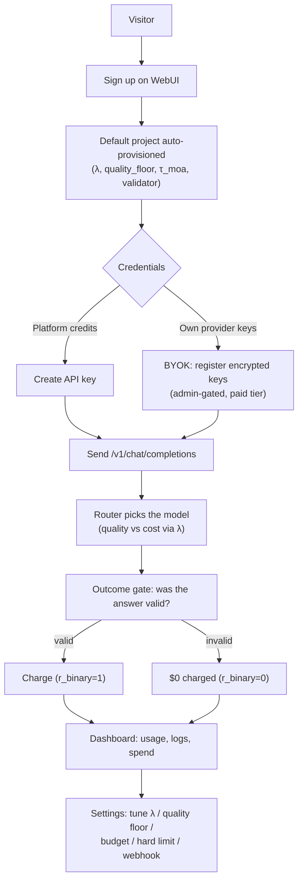
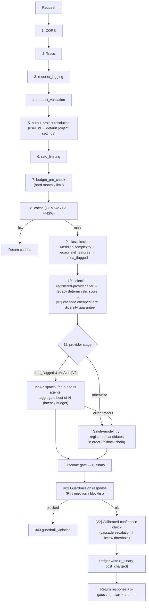

# GaussMeridian — Business & Technical Workflow (V1 vs V2)

> The end-to-end business flow, the request-lifecycle technical workflow, and a detailed
> **V1 (base router) vs V2 (Meridian)** comparison. Grounded in the actual middleware pipeline
> (`services/server/src/routes.rs`, `middleware.rs`). Reminder: V1 and V2 are the **same binary** —
> V2 = the Meridian feature flags on (see the startup runbook).

---

## 1. Business flow (customer journey)

**What the customer gets:** a single OpenAI-compatible endpoint that routes each request to the
best model for their quality/cost preference, bills only for outcomes that pass their validator,
and is fully self-serve (signup, keys, BYOK, settings, password reset) through the WebUI. Every
per-project setting resolves from the user's **default project** (`user_id → default_project`), so
it works identically for session (WebUI) and API-key callers.

**Billing model (outcome-based):** each request writes one `ledger_entry` with `r_binary` — `1`
means the response passed the project's outcome validator and the estimated cost is charged; `0`
means it failed and `cost_charged = 0`. The WebUI logs show this as **Charged / Not charged**.

---

## 2. Technical workflow — request lifecycle

Axum middleware pipeline (outermost first; `.layer()` is innermost-first, so the last-added layer
runs first). A `/v1/chat/completions` request flows through **11 stages**:

**Stage notes:**
- **5 · auth + project resolution** — validates JWT/x-api-key, then resolves the caller's project
  settings via `user_id → default_project` (the load-bearing fix; works for both auth types).
- **9 · classification (current P1 boundary)** — the deterministic Meridian estimator scores
  complexity `∈ [0,1]`; when `complexity ≥ τ_moa` it sets `moa_flagged`. The existing 12-dimension
  skill vector is legacy heuristic infrastructure; formal BELLA skill evidence remains open work.
- **10 · selection** — filters candidates to **registered** providers (so the fallback chain is
  all-servable), scores them with the legacy deterministic product formula (`quality`, `cost`,
  `health`, `λ`), and [V2] reorders cheapest-first for cascade; a diversity guarantee keeps an
  alternate provider in the retry window. This formula is not the xRouter learned policy; formal
  xRouter work remains open.
- **11 · provider stage** — the decision point:
  - **[V2] MoA path** (`moa_flagged` + `GAUSSMERIDIAN_MOA`): dispatch to the in-process MoA engine —
    fan out to N agents **in parallel** through the shared provider stack, isolate per-agent
    failures, aggregate best-of-N. On any error or latency-budget breach, **fall through** to the
    single-model chain.
  - **Single-model path** (V1 default / V2 fallback): attempt registered candidates in ranked
    order up to `GAUSSMERIDIAN_MAX_PROVIDER_ATTEMPTS`, skipping open circuit breakers.
  - Then the **outcome gate** sets `r_binary`, **[V2] guardrails** inspect the response,
    **[V2] cascade** escalates on low calibrated confidence, and the **ledger** row is written.

Response headers expose the decision: `x-gaussmeridian-model` / `-provider` (who served),
`-candidates` (the fallback chain), `-r-binary` + `-cost` (billing), `-moa: true` (V2 MoA path),
`-guardrail: blocked` (V2 guardrail hit).

---

## 3. V1 vs V2 — capability comparison

| Capability | V1 (base router) | V2 (Meridian) |
|---|---|---|
| **Endpoint** | OpenAI-compatible `/v1/chat/completions` | same |
| **Classification** | Meridian complexity + legacy skill features (sets `moa_flagged`, logged only) | same signals, now **actioned** by MoA |
| **Model selection** | registered-provider filter + legacy deterministic score, **score-descending** | + **cascade**: cheapest-first ordering |
| **Serving** | single model + cross-provider fallback chain | + **GaussMoA**: multi-agent fan-out on complex queries, falls back to single-model |
| **Confidence** | raw provider confidence (if any) | **calibrated** `σ(logit(raw)/T)`; escalate to a stronger model when below threshold |
| **Safety** | none at the gateway | **guardrails**: block responses with PII / injection / blocked terms |
| **Billing** | outcome-gate ledger (`r_binary`, charged vs $0) | same, plus one aggregate `moa_flagged` row per MoA run |
| **Resilience** | provider-aware candidates + fallback *(base fix, in both)* | same |
| **How to enable** | default (no flags) | `GAUSSMERIDIAN_GUARDRAIL_*`, `GAUSSMERIDIAN_CASCADE`, `GAUSSMERIDIAN_MOA` |

### The three V2 upgrades in one line each
1. **Guardrails** — output filtering (PII / prompt-injection / blocklist) before a response leaves
   the gateway; a hit returns `403 guardrail_violation`.
2. **Cascade routing + confidence calibration** — order candidates cheapest-first, calibrate the
   provider's self-reported confidence with a temperature `T`, and escalate to a stronger model
   only when the calibrated confidence is below `GAUSSMERIDIAN_CASCADE_THRESHOLD` — cheaper on easy
   queries, stronger on hard ones.
3. **GaussMoA** — when Meridian flags a query as complex (`complexity ≥ τ_moa`), orchestrate several
   agents in parallel through the shared provider stack and aggregate their answers; any failure
   or a latency-budget breach transparently falls back to single-model, so MoA never makes a
   request less reliable.

### What V2 does NOT change
Same API surface, same auth/billing/BYOK, same WebUI. V2 is additive and per-request: an
un-flagged simple query in V2 mode takes the exact V1 path. Turning every V2 flag off yields
byte-for-byte V1 behavior — the modes share one binary and one code path.

---

## 4. Where each piece lives (code map)

| Concern | File |
|---|---|
| Pipeline wiring (layer order) | `services/server/src/routes.rs` |
| Classification (Meridian + legacy skill features), selection, provider stage, MoA gate, guardrails, cascade, ledger | `services/server/src/middleware.rs` |
| Project resolution (`user_id → default project`) | `middleware.rs::load_project_settings` |
| MoA gateway integration (adapter, engine build, dispatch/translation) | `services/server/src/moa.rs` |
| MoA engine (fan-out, aggregation, agents) | `crates/gaussmeridian-moa/` |
| Meridian estimator / CARROT conditional predictor / legacy skill infrastructure / deterministic routing policy / calibration / guardrails | `crates/gaussmeridian-core/` |
| Provider adapters (openai, anthropic, …) | `crates/gaussmeridian-providers/` |
| Outcome-billing ledger | `crates/gaussmeridian-db/src/repositories/ledger_repository.rs` |
| WebUI (self-serve dashboard) | `gauss-boilerplate` (branch `product/gauss-meridian`) |
