# 09 — MVP Human Status

> [!warning] Superseded routing snapshot
> This May 2026 M1/M2 plan is retained as historical build evidence, not current implementation authority. Later routing-intelligence work supersedes its routing labels. Current boundary: deterministic Meridian is implemented; CARROT is mechanism-qualified but production promotion remains blocked; BELLA and xRouter compound routing remain open. Neither is implemented by the legacy heuristic named below.

> Updated: 2026-05-11 (post-Sprint M1)
> Audience: maintainers and human reviewers

---

## Sprint M1 — Completed 2026-05-11

Sprint M1 (Foundation compiles, auth and cache work) is **done**. The server compiles clean, auth is enforced, rate limiting is active, BYOK is operational, L1 cache is live, and the SurrealDB M1 schema is applied.

Build: `cargo check` exits 0, warnings only (full workspace including gaussmoa).
Tests: 28 unit tests pass (gaussmeridian-auth: 20, gaussmeridian-cache: 8).

## M1 Reality Check

| Area | Status | Notes |
|------|--------|-------|
| Health and metrics | ✅ Present | `/health` and `/metrics` registered |
| Docker Compose | ✅ Present | GaussMeridian, SurrealDB, Redis, Prometheus, Grafana |
| Streaming route | ✅ Wired | `POST /v1/chat/completions/stream` registered |
| Tower middleware stack | ✅ Wired | `logging → validation → auth → rate-limit → cache → handler` |
| Auth enforcement | ✅ Active | `auth_middleware_with_state` on all `/v1/*` paths; 401 on missing credentials |
| Rate limiting | ✅ Active (in-memory) | Shared `RateLimiter` via `AppState`; Redis sliding-window deferred to M2 |
| Redis probe | ✅ Graceful | Startup probe; `redis_connected: bool` in `AppState` |
| SurrealDB version | ✅ Resolved | Both Cargo and Docker pinned at v2.0 |
| SurrealDB schema | ✅ M1 applied | `org`, `team`, `api_key`, `project`, `provider_model`, `ledger_entry`, `cache_entry` + HNSW index |
| BYOK vault | ✅ Live | AES-256-GCM; `BYOK_MASTER_KEY` from env; graceful degradation if absent |
| Moka L1 cache | ✅ Live | `AppState.l1_cache`; exact-match SHA-256 keyed; TTL + LRU eviction |
| L3 HNSW semantic cache | ⚙️ Gated | Table + index defined; embedding generation not wired (M2) |
| Pass-through proxy | Partial | `/v1/chat/completions` works with env provider keys; BYOK vault ready but not yet wired to provider calls |
| gaussmoa compile | ✅ Clean | `cargo check -p gaussmoa` exits 0 |

## What Remains for M2

| Area | What's Needed |
|------|--------------|
| Redis rate limiting | Replace in-memory `RateLimiter` with Redis sliding-window |
| L3 HNSW cache | Wire embedding provider call; query `cache_entry` with cosine ≥ 0.95 |
| ClassificationMiddleware | Meridian deterministic complexity evidence plus explicitly advisory legacy skill features; do not call either CARROT or BELLA |
| SelectionMiddleware | `quality_floor` + compliance + deterministic Meridian ballot; CARROT production promotion, BELLA P3, and xRouter P5 remain separate gates |
| ProviderMiddleware | Selected-provider HTTP call, streaming, circuit breaker, retry + fallback (max 3) |
| OutcomeMiddleware | Validator dispatch, `r_binary` determination, retry on 0 |
| BudgetMiddleware | Cost compute, EWMA update, CB update, ledger write, alerts |
| MoA REST API | Remove `unimplemented!()` stubs (gated behind `#[cfg(feature = "moa")]`) |

## Human Graph

```mermaid
flowchart TB
    M1["M1 Foundation — COMPLETE"]
    M2["M2 Routing Intelligence — NEXT"]

    M1 --> Done["Fully Done"]
    Done --> Health["/health + /metrics"]
    Done --> Compose["Docker Compose"]
    Done --> Stream["Streaming route"]
    Done --> Stack["Tower middleware stack"]
    Done --> Auth["Auth enforcement"]
    Done --> RL["Rate limiting (in-memory)"]
    Done --> Schema["SurrealDB M1 schema + HNSW"]
    Done --> Byok["BYOK vault (AES-256-GCM)"]
    Done --> Moka["Moka L1 cache"]
    Done --> CMW["CacheMiddleware (L1 live)"]

    M1 --> Partial["Partly Done"]
    Partial --> L3["L3 HNSW — table defined, embedding not wired"]
    Partial --> Proxy["Proxy — env keys; BYOK not wired to provider calls yet"]

    M2 --> Next["M2 Targets"]
    Next --> RedisRL["Redis sliding-window rate limiting"]
    Next --> L3W["L3 HNSW embedding wiring"]
    Next --> CMW2["ClassificationMW + SelectionMW"]
    Next --> PMW["ProviderMW + OutcomeMW + BudgetMW"]
    Next --> MoA["MoA REST API"]
```

## Bottom Line

M1 is complete and the foundation is solid. The server enforces auth, rate limits requests, checks L1 cache before forwarding, and has the SurrealDB schema in place for billing and semantic cache. M2 is the routing intelligence milestone — classification, selection, and the full provider dispatch pipeline.
